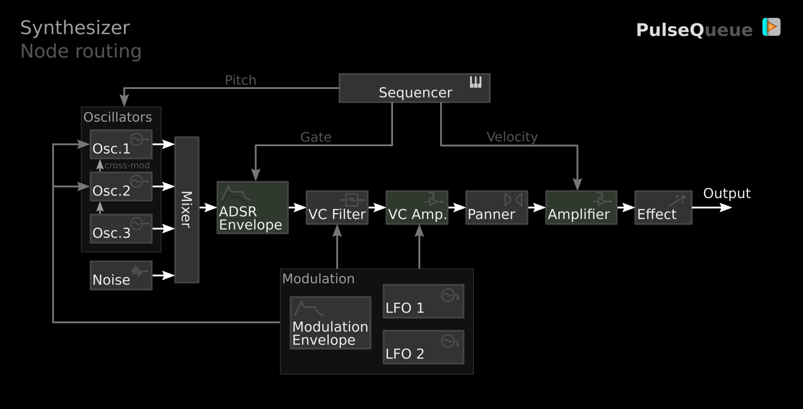

# PulseQueue

Minimalistic web-application for creating electronic music with digital synthesizers.  
Initially designed as sketching tool but can be used for making full-fledged tracks :musical_note::notes:

**[:link: RUN IN BROWSER :link:](https://valent-in.github.io/pulseq)**

- Simple and easy to use
- Mobile-friendly
- Client only (no data processed on servers)

- Subtractive synthesizers with various effects
- Harmonic oscillators & basic FM
- Multi-layered step sequencer
- Exportable synth presets
- WAV audio export
- MIDI export

## Music examples (YouTube)
- [Cosmix - part 1](https://www.youtube.com/watch?v=KkLsClq37w4)
- [Cosmix - part 2](https://www.youtube.com/watch?v=8_aYqIMCa2k)
- [Clean Steps](https://www.youtube.com/watch?v=2IaCb21nIZU)

## Quick start
To get started you can experiment with included songs. Click "Demo" button on startup menu and select demo track. Reload page to reach this menu again.

**Program tabs:**  
ARRANGE :cd:  
Combine patterns into complete music track.

PATTERN :musical_keyboard:  
Place notes here. Synth engine is monophonic (single-voice), additional voices can be added with pattern layers.

SYNTH :control_knobs:  
Configuration panel for selected instrument. Presets are available from 3-dot menu.

LIST :level_slider::level_slider:  
Contains list of synthesizers and also a mixer.

## Reference Cards

## Performance notes
- Some effects are CPU-heavy (especially reverb and phaser). This should be accounted when using on mobile devices.  
- WAV export duration may be limited on mobile browsers to about 10 minutes.

---
Using Web Audio API and [Tone.js](https://github.com/Tonejs/Tone.js)  
File export sources:
[bufferToWave](https://github.com/rwgood18/javascript-audio-file-dynamics-compressor),
[midi-writer](https://github.com/carter-thaxton/midi-file).

This program is free software: you can redistribute it and/or modify it under the terms of the GNU General Public License version 3.  
This program is distributed in the hope that it will be useful, but WITHOUT ANY WARRANTY.