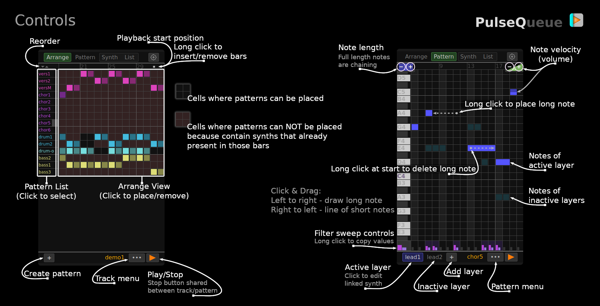

# PulseQueue

Minimalistic web-application for creating electronic music. Features virtual analog synthesizers and multi-layered step sequencer.  
Boost your creativity!

**https://valent-in.github.io/pulseq/**

- Simple and easy to use
- Low resource consumption
- Mobile-friendly
- Free

## Music examples (YouTube)
- [Cosmix - part 1](https://www.youtube.com/watch?v=KkLsClq37w4)
- [Cosmix - part 2](https://www.youtube.com/watch?v=8_aYqIMCa2k)
- [Clean Steps (upd)](https://www.youtube.com/watch?v=2IaCb21nIZU)

## Reference Cards

---
Using Web Audio API and [Tone.js](https://github.com/Tonejs/Tone.js)

This program is free software: you can redistribute it and/or modify it under the terms of the GNU General Public License version 3.  
This program is distributed in the hope that it will be useful, but WITHOUT ANY WARRANTY.